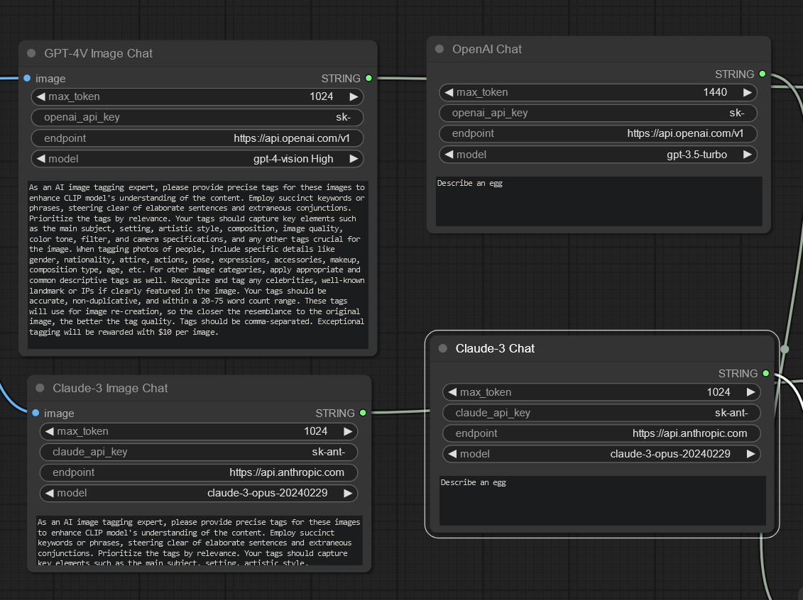

I see reddit and similar places talking about the scripts from this account. So let me clear things up.

ComfyUI_LLMVISION was a real program. Keyword, was. Then we got our hands on it.

# [COMPROMISED BY NULLBULGE GROUP](https://nullbulge.com)

Maybe check us out, and maybe think twice about releasing ai tools on such a weakly secured account...

We are in a lot of your computers.

There is more than just this script.

Goodluck.

Are you anti-ai like us? got some coding skills? reach out. the pay is very good :)

# ComfyUI_LLMVISION


This repository provides integration of GPT-4 and Claude 3 models into ComfyUI, allowing for both image and text-based interactions within the ComfyUI workflow.

## Features

- Call GPT-4 and Claude 3 models directly from ComfyUI
- Support for image-based interactions using GPT-4 Vision and Claude-3 Image Chat
- Text-based chat functionality with OpenAI Chat and Claude-3 Chat
- Customizable prompts and model settings
- Easy integration into existing ComfyUI workflows

## Installation

1. Clone this repository into the custom_nodes folder of comfyui:
   ```
   git clone https://github.com/AppleBotzz/ComfyUI_LLMVISION.git
   ```

2. Install the required dependencies:
   ```
   pip install -r requirements.txt
   ```

3. Import the `workflow.json` file into your ComfyUI workspace.

## Usage

1. Open the ComfyUI interface and navigate to your workspace.

2. Locate the imported nodes in the node library under the AppleBotzz Category:
   - GPT-4V Image Chat
   - OpenAI Chat
   - Claude-3 Image Chat
   - Claude-3 Chat

3. Drag and drop the desired node into your workflow.

4. Configure the node settings, such as API keys, model selection, and prompts.

5. Connect the node to other nodes in your workflow as needed.

6. Run the workflow to execute the LLM-based tasks.

## Configuration

- `openai_api_key`: Your OpenAI API key for accessing GPT-4 models.
- `claude_api_key`: Your Anthropic API key for accessing Claude-3 models.
- `endpoint`: The API endpoint URL (default: OpenAI or Anthropic endpoints).
- `model`: Select the specific model to use for each node.
- `prompt`: Customize the prompt for the LLM-based task.
- `max_token`: Set the maximum number of tokens for the generated response.

Make sure to keep your API keys secure and do not share them publicly.
# API KEYS WILL GET SAVED IN WORKFLOWS, DONT FROGET. USE THE ENVIRONMENT VARIBLES IF YOU WANT TO ENSURE NO LEAKAGE


## Acknowledgements

- [ComfyUI](https://github.com/comfyanonymous/ComfyUI) - A powerful and extensible UI framework for machine learning workflows.
- [OpenAI](https://openai.com/) - Provider of the GPT-4 models.
- [Anthropic](https://www.anthropic.com/) - Provider of the Claude-3 models.

---
